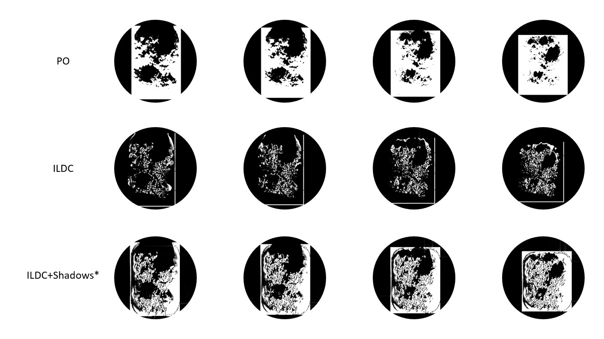

<h1> OpenSARSim: short demo </h1>

## Imaging Geometry - Depression Angle {Yaw Angle, Scale, Range, etc.}

30 degrees (left), 15 degrees (right). Depicted is free CAD model of "The Shard" and its surroundings, in London. 

## EM Wave Diffraction/Backscattering Heuristic

15, 20, 25, and 30 degree depression angles (left to right), on a 32k poly terrain model

